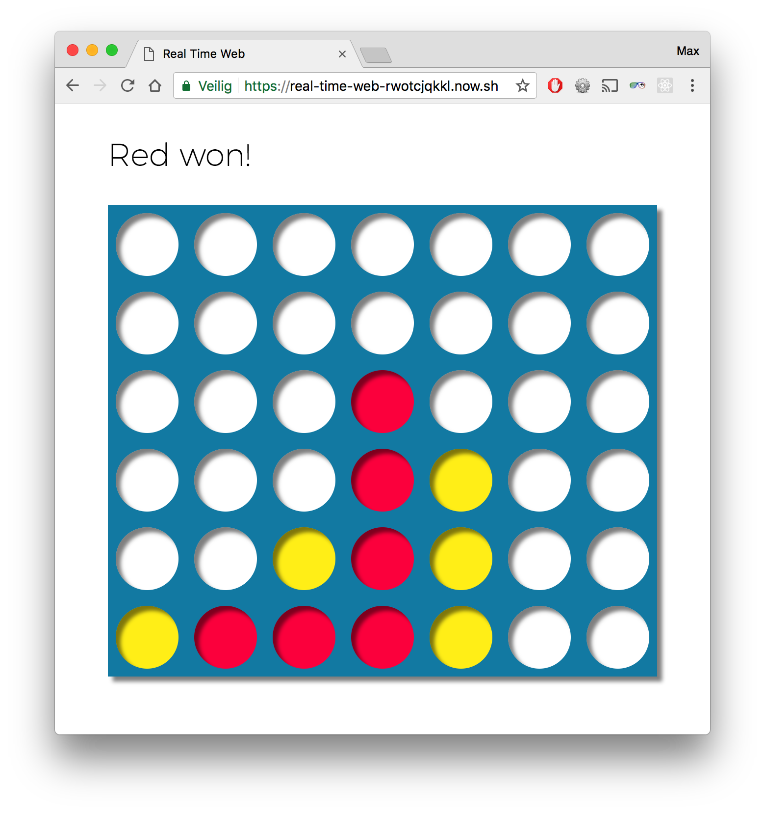

# Real-time Connect Four game

For the school subject "Real-Time Web", I created a web app that uses templating, routing and a remote database.

This is a Connect Four game, made real-time with [socket.io](https://socket.io/).

[Live demo](https://real-time-web-rwotcjqkkl.now.sh/)

## Installing

In order to install this app on your local computer, fork this repo, then run `git clone` in your terminal and install the packages with npm, using `npm install`.

## Getting started

To start the game locally, run `npm start`. The server will run by default on port 3000.

## Features

* [x] Playing real time
* [x] Calculating a win in horizontal and vertical direction

## What's used?

* [x] [Socket.io](https://socket.io/)
* [x] [EJS](http://ejs.co/)
* [x] [Express](expressjs.com)
* [x] [Sass](https://sass-lang.com/)

## To do

* [ ] Calculating a win in diagonal direction
* [ ] Waiting on an opponents turn
* [ ] Adding a waiting room when when there are no opponents
* [ ] Adding multiple game rooms
* [ ] Giving a more fluid playing experience
