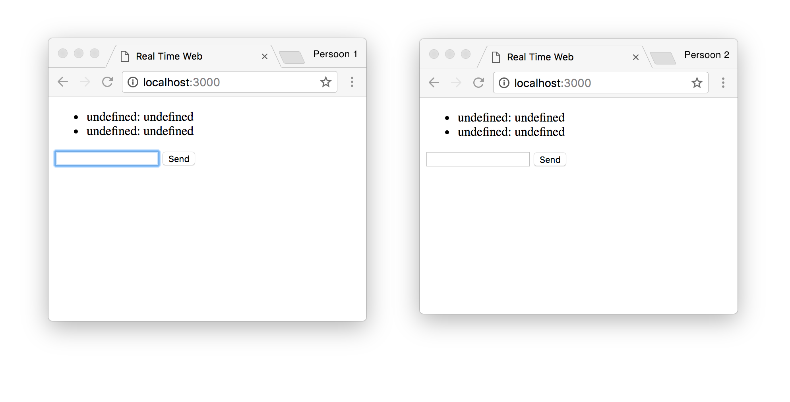

# Real-time chat

For the school subject "Real-Time Web", we'll create a web app that uses templating, routing and a remote database. 

This is a basic chat app, made with [socket.io](https://socket.io/). The assignment is to set up this basic chat with the addition of a feature to your choice.


###### Setting up the environment. 

 fork the repo, found on []
 1. run ```npm init``` to initialize the npm package
 2. install the following modules: 
    - [Express](https://expressjs.com/)
    - [Nodemon](https://nodemon.io/)
    - [EJS](http://www.embeddedjs.com/)
3. write the following in index.js: 
```javascript
var express = require("express")
var app = express()
var port = 4000

app.listen(port, console.log('listen on port:' + port);
```


